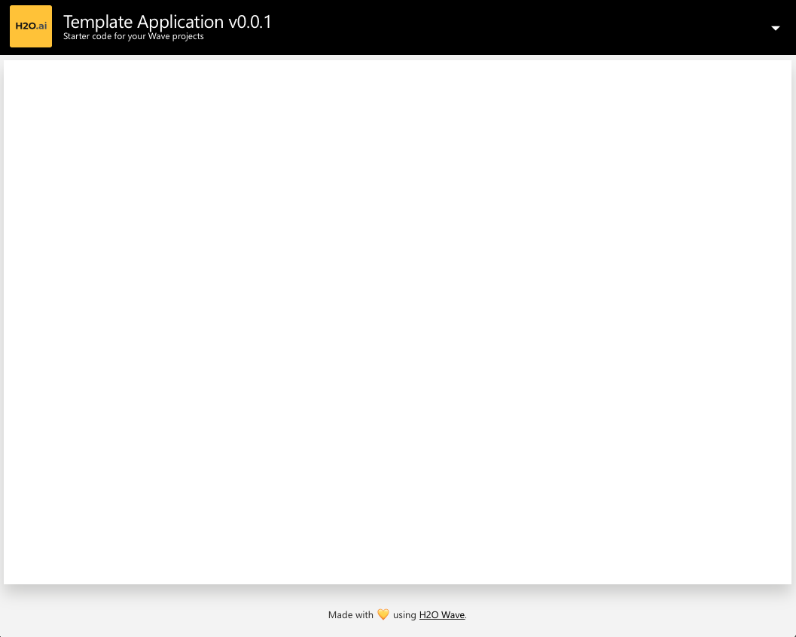

# New Project Template

The template I use when starting new H2O Wave app projects. 




## Local Development

Create a python environment in the home app directory and install requirements. Python 3.7 is recommended but not 
required to align with the default runtime in the AI App Store.

```shell script
python3 -m venv venv
./venv/bin/pip install -r requirements.in
```

When running this application locally, I like to not include logs from the 
Wave server by default to make it easier to read the application logs.
```shell script
H2O_WAVE_NO_LOG=True ./venv/bin/wave run src.app

```

Visit the app at http://localhost:10101

## Publish to the AI App Store
You can test that this app works as expected in your AI App Store using 
```shell script
h2o bundle test
```

And then import the app and publish it to all users with
```shell script
h2o bundle import -v ALL_USERS
```

See the [Installation Instructions](DEPLOY.md) for details as needed.